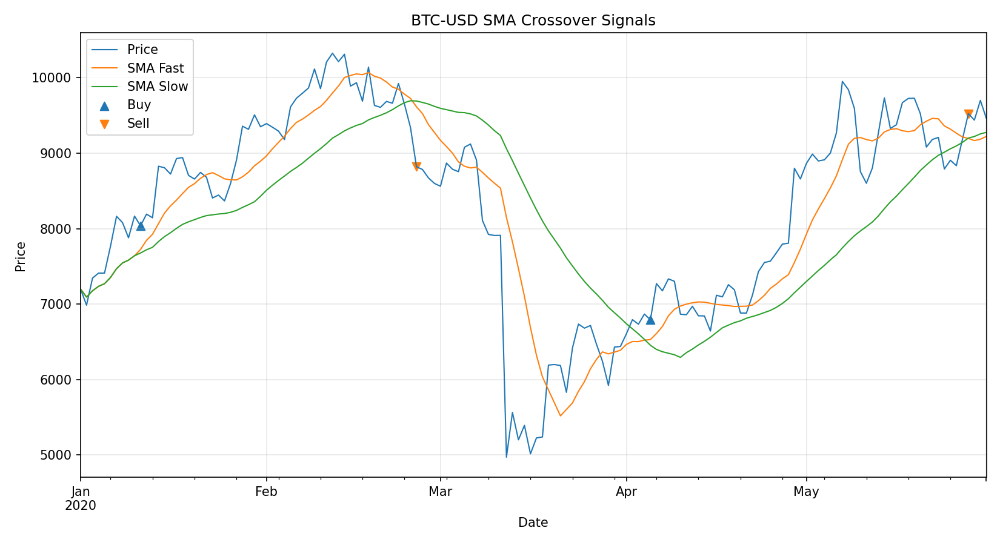
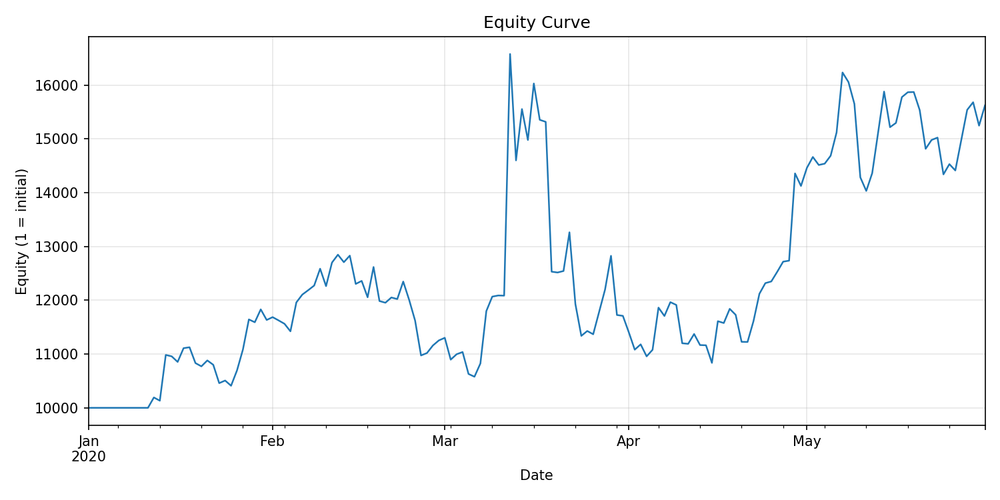

# Alpha-Signal-Research

[](https://www.python.org/)
[](LICENSE)
[](https://github.com/xavierchuan/Alpha-Signal-Research/commits/main)

A lightweight research project for backtesting simple trading strategies (e.g., SMA crossover) on financial time series.

## Features
- Data loading from Yahoo Finance
- Signal generation (SMA crossover strategy)
- Backtesting with equity curve tracking
- Performance evaluation (Sharpe, Max Drawdown, Annual Return, etc.)
- Visualization of signals and equity curve
- Automatic report generation (Markdown)

## Table of Contents
- [Installation](#installation)
- [Usage](#usage)
- [Example Results](#example-results)
- [Project Structure](#project-structure)
- [Contributing](#contributing)
- [License](#license)

## Installation
```bash
git clone https://github.com/xavierchuan/Alpha-Signal-Research.git
cd Alpha-Signal-Research
pip install -r requirements.txt
```

## Usage

Run the demo backtest:
```bash
python tests/run_demo.py
```

Results will be saved under the `results/` directory:
- Plots in `results/plots/`
- Reports in `results/reports/`

## Example Results

**Trading Signals**



**Equity Curve**



**Backtest Report**

The example report is saved under: [`results/reports/backtest_report.md`](results/reports/backtest_report.md)

## Project Structure

```
.
├── data/                # Downloaded or sample financial data
├── results/
│   ├── plots/           # Output plots (signals, equity curve, etc.)
│   └── reports/         # Generated reports (Markdown)
├── src/                 # Source code (strategies, backtest engine)
├── tests/               # Example scripts and test cases
├── requirements.txt     # Python dependencies
└── README.md            # Project documentation
```

## Contributing

Contributions are welcome! Please open an issue or submit a pull request for improvements, new strategies, or bug fixes.

## License

This project is licensed under the MIT License. See the [LICENSE](LICENSE) file for details.
